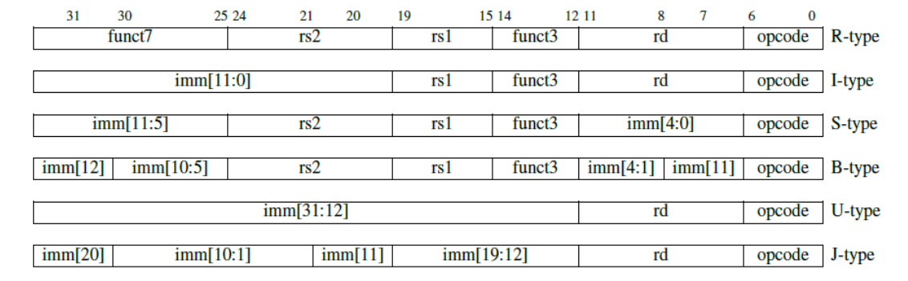
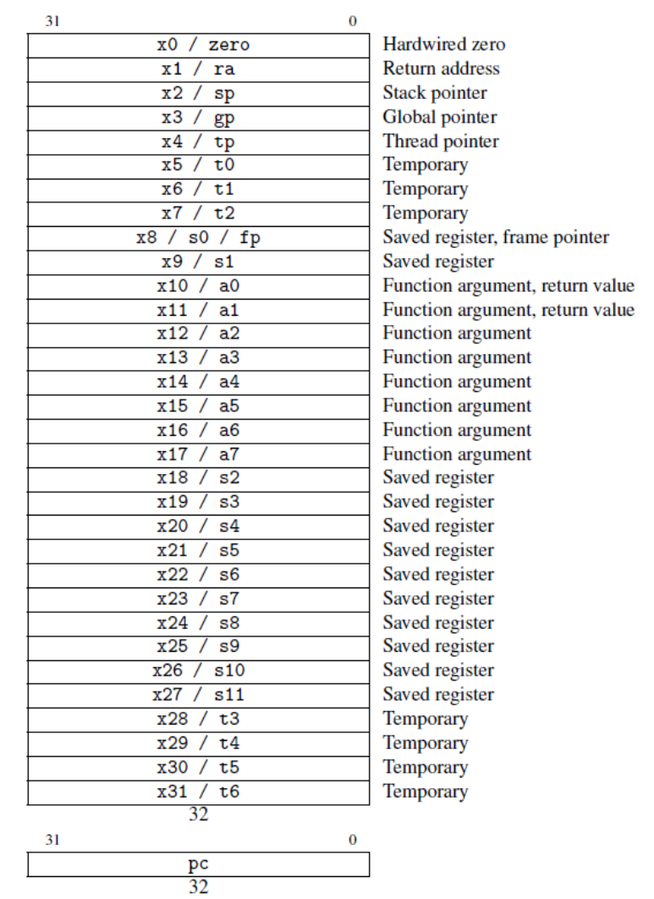

# rvos
基于risv-v的操作系统，运行在`qemu`模拟器上，用于`timer`个人学习`risc-v`架构体系

> 参考链接：
>
> [plctlab/riscv-operating-system-mooc: 《从头写一个RISC-V OS》课程配套的资源 (github.com)](https://github.com/plctlab/riscv-operating-system-mooc/tree/main)
>
> [cccriscv/mini-riscv-os: Build a minimal multi-tasking OS kernel for RISC-V from scratch (github.com)](https://github.com/cccriscv/mini-riscv-os)，

- `asm`: 为`risc-v`的汇编练习代码 
- `os` : 为`rvos`的代码
# 调试记录
 - 当`make debug`时，如果`qemu`的`1234`端口被占用   
   `sudo lsof -i tcp:1234` 找出占用1234端口的进程   
   `sudo kill 1008828` 杀死相关进程即可

## risc-v 架构

在 RISC-V 架构中，一条指令的格式取决于指令的类型和长度。RISC-V 支持 32 位、64 位和 128 位的地址空间，以及可变长度的指令扩展¹。基本的指令集是 `RV32I`，它包含了 `32 `位的整数指令。`RV32I` 可以被划分为六种基本的指令格式³：

- `R-type `指令用于寄存器-寄存器操作，比如 add 或 sub。它们有三个寄存器操作数（rd, rs1, rs2）和一个功能码（funct3 和 funct7）。
- `I-type` 指令用于立即数和加载操作，比如 addi 或 lw。它们有两个寄存器操作数（rd, rs1）和一个 12 位的立即数（imm）。
- `S-type` 指令用于存储操作，比如 sw。它们有两个寄存器操作数（rs1, rs2）和一个 12 位的立即数（imm），其中立即数被分成两部分（imm[11:5] 和 imm[4:0]）。
- `B-type` 指令用于条件分支操作，比如 beq 或 bne。它们有两个寄存器操作数（rs1, rs2）和一个 12 位的立即数（imm），其中立即数被分成四部分（imm[12], imm[10:5], imm[4:1], imm[11]）。
- `U-type` 指令用于高位立即数操作，比如 lui 或 auipc。它们有一个寄存器操作数（rd）和一个 20 位的立即数（imm）。
- `J-type` 指令用于无条件跳转操作，比如 jal 或 jalr。它们有一个寄存器操作数（rd）和一个 20 位的立即数（imm），其中立即数被分成四部分（imm[20], imm[10:1], imm[11], imm[19:12]）。

除了基本的指令集，RISC-V 还支持多种可选的指令扩展，比如 M、A、F、D、Q、C 等¹。这些扩展可能会增加新的指令格式或修改已有的指令格式。例如，C 扩展增加了压缩指令格式，它们只占用 16 位而不是 32 位¹。

> (1) RISC-V Instruction Set Explanation - fraserinnovations. https://fraserinnovations.com/risc-v/risc-v-instruction-set-explanation/.
> (2) RISC-V - Wikipedia. https://en.wikipedia.org/wiki/RISC-V.
> (3) The RISC-V Instruction Set Manual. https://riscv.org/wp-content/uploads/2019/12/riscv-spec-20191213.pdf.

### 指令举例

下面是一个 RISC-V 指令格式的例子，假设我们使用的是 RV32I 基本指令集。

假设我们有一条指令，它的二进制表示是 0000000 00010 00001 000 00001 0110011，它是一个 R-type 指令，它的格式如下：

| funct7  | rs2   | rs1   | funct3 | rd    | opcode  |
| :------ | :---- | :---- | :----- | :---- | :------ |
| 0000000 | 00010 | 00001 | 000    | 00001 | 0110011 |

我们可以从这个格式中提取出以下信息：

- opcode 是 0110011，表示这是一个 R-type 指令。
- rd 是 00001，表示目标寄存器是 x1。
- rs1 是 00001，表示第一个源寄存器是 x1。
- rs2 是 00010，表示第二个源寄存器是 x2。
- funct3 是 000，表示这是一个加法指令。
- funct7 是 0000000，表示这是一个普通的加法指令，而不是溢出检测的加法指令。

因此，这条指令的助记符是 add x1, x1, x2，它的作用是把 x1 和 x2 的值相加，并把结果存储在 x1 中。

### 寄存器详解

RISC-V 的 32 个通用寄存器都是用来存储整数值的，它们的编号是 x0 到 x31。其中，x0 是一个特殊的寄存器，它的值是硬编码为 0 的，不能被修改¹。其他的寄存器都可以被读写，但是它们有不同的用途和约定²。

- x1 是一个返回地址寄存器（ra），它用来存储函数调用后的返回地址。在函数调用时，调用者需要把返回地址保存在 x1 中，然后跳转到被调用函数。在函数返回时，被调用函数需要把 x1 的值恢复到程序计数器（pc）中，然后继续执行调用者的代码。
- x2 是一个栈指针寄存器（sp），它用来指向栈顶的地址。栈是一种后进先出（LIFO）的数据结构，它用来保存函数的局部变量、参数和返回地址等信息。在 RISC-V 中，栈是向下增长的，也就是说栈指针会随着数据的压入而减小，随着数据的弹出而增大。栈指针必须保持 16 字节对齐。
- x3 是一个全局指针寄存器（gp），它用来指向全局变量或静态变量的地址。这样可以减少访问这些变量时所需的立即数的大小，从而节省指令空间。
- x4 是一个线程指针寄存器（tp），它用来指向线程局部存储（TLS）的地址。TLS 是一种为每个线程分配独立的内存空间的机制，它可以让每个线程拥有自己的变量或状态。
- x5 到 x7 是临时寄存器（t0 到 t2），它们用来保存临时数据或中间结果。这些寄存器不需要被调用者或被调用者保存或恢复，也就是说它们可以随意使用而不影响其他函数。
- x8 是一个保存寄存器或帧指针寄存器（s0 或 fp），它用来保存函数调用前后不变的数据或指向函数栈帧的地址。栈帧是栈上分配的一块连续空间，它包含了函数的局部变量、参数和返回地址等信息。帧指针可以方便地访问栈帧中的数据，而不需要知道栈指针的具体值。这个寄存器需要被调用者保存和恢复。
- x9 是一个保存寄存器（s1），它也用来保存函数调用前后不变的数据。这个寄存器也需要被调用者保存和恢复。
- x10 到 x17 是参数或返回值寄存器（a0 到 a7），它们用来传递函数调用时的参数或返回值。如果参数或返回值超过了八个或者超过了寄存器的大小，就需要使用栈来传递。这些寄存器不需要被调用者或被调用者保存或恢复。
- x18 到 x27 是保存寄存器（s2 到 s11），它们也用来保存函数调用前后不变的数据。这些寄存器也需要被调用者保存和恢复。
- x28 到 x31 是临时寄存器（t3 到 t6），它们也用来保存临时数据或中间结果。这些寄存器也不需要被调用者或被调用者保存或恢复。

> (1) The RISC-V Architecture - DZone. https://dzone.com/articles/introduction-to-the-risc-v-architecture.
> (2) Registers - RISC-V - WikiChip. https://en.wikichip.org/wiki/risc-v/registers.
> (3) RISC-V - Wikipedia. https://en.wikipedia.org/wiki/RISC-V.
> (4) Calling Convention - RISC-V. https://riscv.org/wp-content/uploads/2015/01/riscv-calling.pdf.